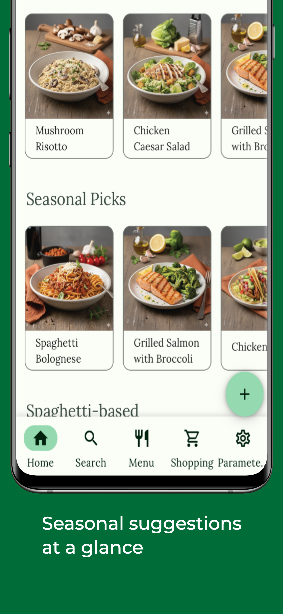
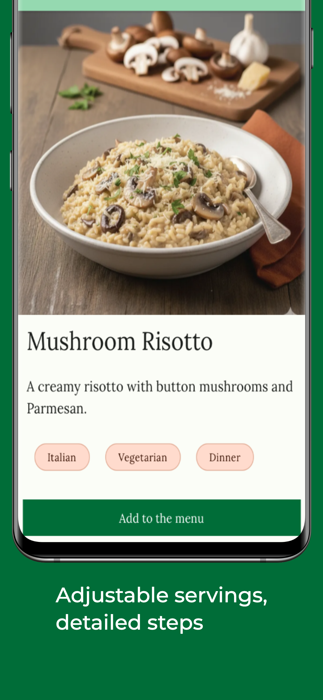
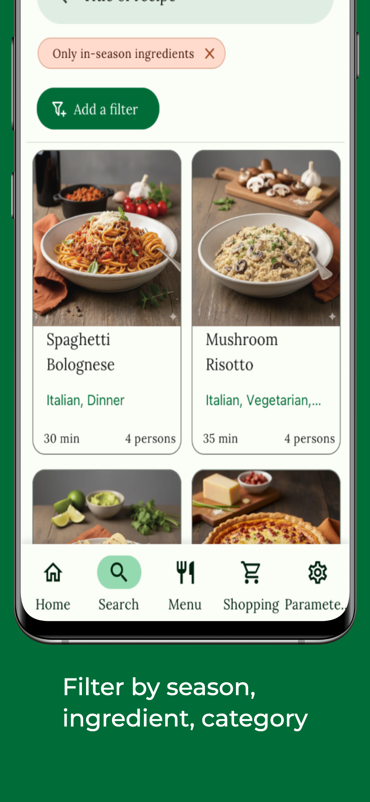
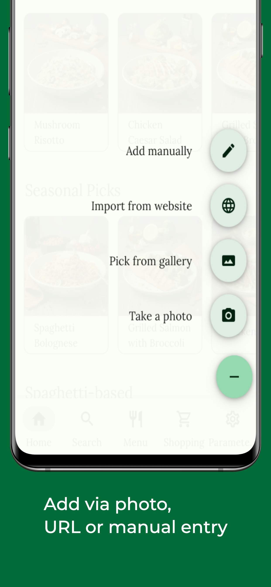
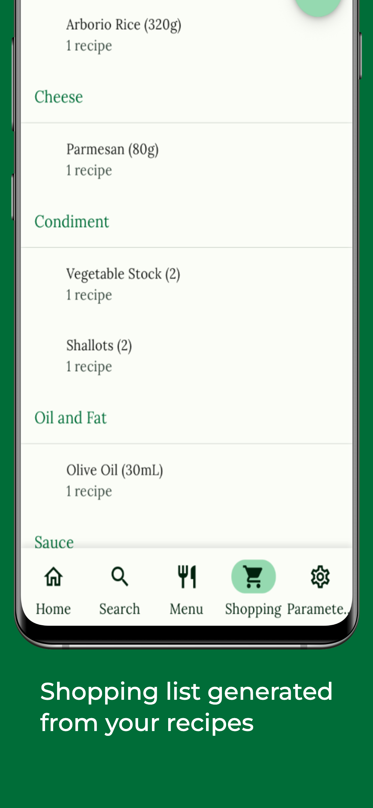

# 🍳 Recipedia

A React Native recipe management app built with Expo — add, search, and manage recipes with OCR scanning and web import.

<div align="center">

[](package.json)
[](https://reactnative.dev/)
[](https://expo.dev/)
[](https://www.typescriptlang.org/)
[](LICENSE)

</div>

## ✨ Features

- 📱 **Cross-platform**: iOS and Android, portrait mode, fully offline
- 🔍 **Smart Search**: Fuzzy search across recipes, ingredients, and tags (MiniSearch)
- 📸 **OCR Scanning**: Extract recipe text from photos using ML Kit
- 🌐 **Web Import**: Import from 400+ recipe websites via an embedded Python scraper
- 📦 **Bulk Import**: Import recipe packs from HelloFresh and Quitoque with a validation workflow
- 🌍 **Multi-language**: English and French
- 🌙 **Dark Mode**: Full dark/light theme
- 🗃️ **Local Storage**: SQLite — all data stays on device, no cloud sync
- 📅 **Weekly Menu**: Plan meals and auto-generate shopping lists
- 🛒 **Shopping Lists**: Derived from your weekly menu with quantity aggregation
- 🏷️ **Smart Filtering**: Filter by ingredients, tags, time, and seasonality
- 🌱 **Seasonal Awareness**: Track ingredient seasonality for better meal planning

## 📷 Screenshots

<div align="center">

| Home | Recipe | Search |
|:----:|:------:|:------:|
|  |  |  |

| Add Recipe | Shopping List |
|:----------:|:-------------:|
|  |  |

</div>

## 🚀 Quick Start

### Prerequisites

- [Node.js](https://nodejs.org/) (v18 or higher)
- [Expo CLI](https://docs.expo.dev/get-started/installation/)
- For Android: [Android Studio](https://developer.android.com/studio) with Android SDK
- For iOS: [Xcode](https://developer.apple.com/xcode/) (macOS only)

### Installation

1. **Clone the repository**
   ```bash
   git clone https://github.com/AntoC-dev/Recipedia.git
   cd Recipedia
   ```

2. **Install dependencies**
   ```bash
   npm install
   ```

3. **Start the development server**
   ```bash
   npm start
   ```

4. **Run on your platform**
   - **Android**: `npm run dev:android`
   - **iOS**: `npm run dev:ios`

## 🏗️ Architecture

Local-first, single-user, no backend. All data lives in a SQLite database on-device.

```
src/
├── components/          # Reusable UI components (Atomic Design)
│   ├── atomic/         # Basic components (buttons, inputs)
│   ├── molecules/      # Composite components
│   └── organisms/      # Complex components
├── screens/            # App screens
├── navigation/         # Navigation configuration
├── context/           # React Context providers
├── hooks/             # Focused data hooks (useRecipes, useShopping, …)
├── utils/             # Utility functions and database
├── styles/            # Theme and styling
├── translations/      # i18n translations
└── customTypes/       # TypeScript type definitions
```

### Key Technologies

| Layer | Library |
|-------|---------|
| Framework | React Native + Expo |
| Database | SQLite via expo-sqlite |
| Navigation | React Navigation v6 |
| State | React Context + hooks |
| UI | React Native Paper |
| Search | MiniSearch (fuzzy, offline) |
| OCR | @react-native-ml-kit/text-recognition |
| i18n | i18next |
| Recipe scraping | [recipe-scrapers](https://github.com/hhursev/recipe-scrapers) via embedded Python (Chaquopy on Android, BeeWare on iOS) |
| Testing | Jest + RNTL + Reassure + Maestro (E2E) |

## 📖 Documentation

- [API Documentation](https://AntoC-dev.github.io/Recipedia/) — TypeScript reference, auto-generated with TypeDoc
- [Architecture](ARCHITECTURE.md) — data flow, DB schema, key invariants
- [Contributing](CONTRIBUTING.md)
- [Installation Guide](guides/installation.md)
- [FAQ](guides/faq.md)

```bash
npm run docs:build    # Generate TypeDoc
npm run docs:clean    # Clean build
```

## 🧪 Testing

### Unit Tests

```bash
npm run test:unit           # Run unit tests (tests/unit/)
npm run test:unit:watch     # Watch mode
npm run test:unit:coverage  # With coverage report
```

### Integration Tests

```bash
npm run test:integration    # Cross-module integration tests (tests/integration/)
```

### Performance Tests

```bash
npm run test:perf           # Reassure render benchmarks
```

### End-to-End Tests

```bash
npm run test:e2e:android             # Run E2E tests on Android
npm run workflow:build-test:android  # Full build + test cycle
```

## 🔧 Development

### Available Scripts

| Command | Description |
|---------|-------------|
| `npm start` | Start Expo development server |
| `npm run dev:android` | Run on Android device/emulator |
| `npm run dev:ios` | Run on iOS device/simulator |
| `npm run quality` | Full quality suite (lint + format + typecheck + expo:doctor) |
| `npm run lint:fix` | Auto-fix lint issues |
| `npm run format` | Run Prettier |
| `npm run typecheck` | TypeScript check |
| `npm run build:test:android` | Build Android APK for testing |
| `npm run build:test:ios` | Build iOS app for testing |
| `npm run release` | Create semantic release |

## 📱 Device Support

- **iOS**: 13.0+
- **Android**: 6.0+ (API 23+)

## 🔐 Privacy

- All data stored locally — no cloud sync, no account required
- Camera used only for OCR scanning
- No analytics, no tracking

## 🤝 Contributing

See [CONTRIBUTING.md](CONTRIBUTING.md) for full guidelines.

1. Fork the repository
2. Create a feature branch (`git checkout -b feature/123-my-feature`)
3. Make your changes and add tests
4. Run quality checks (`npm run quality`)
5. Commit with a conventional message (`feat(#123): add my feature`)
6. Open a Pull Request

## 🐛 Issues & Requests

Use [GitHub Issues](https://github.com/AntoC-dev/Recipedia/issues) to report bugs or request features.

## 📄 License

MIT — see [LICENSE](LICENSE).

## 🙏 Acknowledgments

- [recipe-scrapers](https://github.com/hhursev/recipe-scrapers) — the Python library powering web import, supporting 400+ sites. Huge thanks to [Hristo Harsev](https://github.com/hhursev) and all contributors.
- [Expo](https://expo.dev/), [React Native](https://reactnative.dev/), [React Native Paper](https://reactnativepaper.com/)
- [ML Kit](https://developers.google.com/ml-kit) for OCR
- [Chaquopy](https://chaquo.com/chaquopy/) for Python on Android
- [BeeWare](https://beeware.org/) for Python on iOS

---

<div align="center">

[⭐ Star this repo](https://github.com/AntoC-dev/Recipedia) • [🐛 Report bug](https://github.com/AntoC-dev/Recipedia/issues) • [✨ Request feature](https://github.com/AntoC-dev/Recipedia/issues)

</div>
